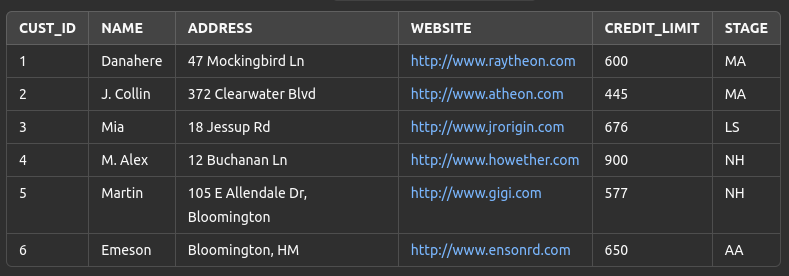

# Module 03: Structure and Operations

## Table of Contents

<ol>
    <li><a href="#overview">Overview</a></li>
    <li><a href="#overview">Overview</a></li>
    <li><a href="#objectives">Objectives</a></li>
    <li><a href="#data-definition-language">Data Definition Language</a></li>
    <li><a href="#data-manipulation-language">Data Manipulation Language</a></li>
    <li><a href="#exercises">Exercises</a></li>
</ol>

## Overview

This chapter provides a comprehensive understanding of data structures and their manipulation within a database
environment. It covers the fundamental operations such as creating, modifying, deleting tables, and managing data. The
focus is on applying SQL commands effectively to perform various data manipulation tasks.

## Objectives

- Define and create data structures using SQL.
- Modify existing data structures to meet business requirements.
- Perform data manipulation operations such as inserting, updating, and deleting records.
- Understand the differences between DELETE and TRUNCATE operations.
- Use SQL constraints to enforce data integrity.

## Data Definition Language

1. Create Table (`CREATE TABLE`)
    - The CREATE TABLE statement is used to create a new table.
    - Definition Includes:
        - Table Name: Must be unique within the database.
        - Attributes:
            - Field names (Columns): Each field includes additional information such as data type, default value, and
              integrity constraints.
            - Data Type
            - Field Constraints
    - Syntax:
      ```sql
      CREATE TABLE table_name (
        column1 datatype constraint,
        column2 datatype constraint,
        ...
      );
      ```
    - Constraints:
        - NULL/NOT NULL
        - IDENTITY
        - DEFAULT
        - PRIMARY KEY
        - FOREIGN KEY/REFERENCES
        - CHECK
    - Example:
      ```sql
       CREATE TABLE customers (
        customer_id NUMBER(10) NOT NULL, -- Customer ID: Unique identifier, primary key, number type with max length 10, and not NULL.
        customer_name VARCHAR2(50) NOT NULL, -- Customer name: Name of the customer, varchar2 type with max length 50, and not NULL.
        city VARCHAR2(50) -- City: City name where the employee resides, varchar2 type with max length 50, and can be NULL.
      );
      ```
2. Drop Table (`DROP TABLE`)
    - Deletes a table and all its data.
    - Syntax:
      ```sql
      DROP TABLE table_name;
      ```
    - Example:
      ```sql
      DROP TABLE customers; -- Delete customers table.
      ```
3. Alter Table (`ALTER TABLE`)
    - Modifies an existing table.
    - Rename Table (`RENAME TO`):
        - Syntax:
          ```sql
          ALTER TABLE table_name RENAME TO new_table_name;
          ```
        - Example:
          ```sql
          ALTER TABLE customers RENAME TO retailers; -- Rename customers table to retailers.
          ```
    - Rename column (`RENAME COLUMN`):
        - Syntax:
          ```sql
          ALTER TABLE table_name RENAME COLUMN old_name TO new_name;
          ```
        - Example:
          ```sql
          ALTER TABLE customers RENAME COLUMN customer_name TO cname; -- Rename customer_name column to cname.
          ```         
    - Add column (`ADD COLUMN`):
        - Use syntax ADD to a column into a table
        - Syntax:
          ```sql
          ALTER TABLE table_name ADD column_name datatype;
          ```
        - Example:
          ```sql
          ALTER TABLE customers ADD (customer_type varchar2(50), -- Add column customer type: type of the customer, varchar2 type with max length 50.
          customer_address varchar2(50)); -- Add column customer address: location of the customer, varchar2 type with max length 50.
          ```       
    - Modify column (`MODIFY`):
        - To modify column data type
        - Syntax:
          ```sql
          ALTER TABLE table_name MODIFY column_name datatype constraint;
          ```
        - Example:
          ```sql
          ALTER TABLE customers MODIFY (
          customer_name varchar2(100) not null, -- Change custome name type to varchar2 type with max length 100, and not NULL.
          city varchar2(100)); -- Change city type to varchar2 type with max length 100.
          ```       
    - Drop column (`DROP COLUMN`):
        - To remove a column from the table
        - Syntax:
          ```sql
          ALTER TABLE table_name DROP COLUMN column_name;
          ```
        - Example:
          ```sql
          ALTER TABLE customers DROP COLUMN customer_name; -- Drop colum customer_name from the customers table.
          ```

## Data Manipulation Language

1. Insert Data (`INSERT`)
    - Adds new records into a table.
    - Syntax:
      ```sql
      INSERT INTO table_name (column1, column2, ...) VALUES (value1, value2, ...);
      ```
    - Example:
      ```sql
      INSERT INTO (name, address, website, credit_limit) VALUES 
      (‘Alex’ ,’Paris’,’http://www.alex.com’, 400); -- Insert a customer into customers table.
      ``` 
      ```sql
      INSERT INTO (name, address, website, credit_limit) VALUES
      (‘Alex’ ,’Paris’,’http://www.alex.com’, 400),
      (‘Tom’ ,’Paris’,’http://www.tom.com’, 500),
      (‘Henry’ ,’Paris’,’http://www.henry.com’, 600); -- Insert 3 customers into customers table.
      ``` 
    - Combine with `SELECT` query
    - Syntax:
      ```sql
      INSERT INTO table_name (column1, column2, ...) <SELECT query>;
      ```
    - Example:
      ```sql
      INSERT INTO suppliers (supplier_id, supplier_name)
      SELECT customer_id, name
      FROM customers
      WHERE credit_limit >= 200; -- Insert a record into suppliers table using SELECT query.
      ```        
2. Update Data (`UPDATE`)
    - Modifies existing data in the table.
    - The values of the columns <column1>, <column2> … of the records that satisfy the conditions after the WHERE clause
      will be updated to <value1>, <value2> ….
    - If there is no WHERE clause, all records in the table will be updated.
    - Syntax:
      ```sql
      UPDATE <Table name> SET <column1 = value1>, <column2 = value2>…,<column n = value n> [WHERE <Constraint>];
      ```
    - Example:
      ```sql
      UPDATE customers SET credit_limit = 600 WHERE customer_id = 1; -- Update customer's credit limit to 600 for customer id equal to 1 in the customers table.
      ``` 
3. Delete Date (`DELETE`)
    - Deletes specific records from a table.
    - The records that satisfy the conditions in the WHERE clause will be deleted from the table.
    - If there is no WHERE clause, all records in the table will be deleted from the table.
    - Available for rollback.
    - Syntax:
      ```sql
      DELETE FROM table_name WHERE condition;
      ```
    - Example:
      ```sql
      DELETE FROM customers WHERE customer_id = 1; -- Delete customer who has id equal to 1 in the customers table.
      ``` 
4. Truncate Table (`TRUNCATE`)
    - Deletes all records from a table without the ability to rollback.
    - Not available for rollback.
    - Syntax:
      ```sql
      TRUNCATE TABLE table_name;
      ```
    - Example:
      ```sql
      TRUNCATE TABLE customers; -- Delete all record in the customers table.
      ``` 

## Exercises

1. CREATE TABLE
    - Create table <student_name>_Customer base on below structure:

      | COLUMN_NAME  | DATA_TYPE      | NULLABLE |
             |--------------|----------------|----------|
      | CUSTOMER_ID  | NUMBER         | NO       |
      | NAME         | VARCHAR2(255)  | NO       |
      | ADDRESS      | VARCHAR2(255)  | YES      |
      | WEBSITE      | VARCHAR2(255)  | YES      |
      | CREDIT_LIMIT | NUMBER(8,2)    | YES      |

    - Add column STAGE(VARCHAR2(10)) into <student_name>_Customer table
2. INSERT/DELETE/UPDATE
    - Insert into <student_name>_Customer table these below record:
      .
    - Delete customers record which satisfy the below conditions in the <student_name>_Customer table:
        - NAME: Danahere
        - ID: 4
        - CREDIT_LIMIT < 500
    - In the table <student_name>_Customer, set Website to http://inda.vn for Customer ID equal to 5
    - In the table <student_name>_Customer, set CREDIT_LIMIT to 1200 for Customer ID equal to 6
3. CREATE..SELECT
    - Create the table <student_name>_Customer_Backup from the table <student_name>_Customer.
4. TRUNCATE
    - Delete all data from the table <student_name>_Customer.
5. DROP
    - Delete the table <student_name>_Customer.
6. Homework

- From the file [Oils.xlsx](https://drive.google.com/file/d/1ekBZ_x_yhZ4WoOluMa2jSsLneN1Lh-5h/view), create a table
  named <student_name>_Oils according to the structure in the file.
- Insert all data from the file into the table <student_name>_Oils.
- Use queries to answer the following questions:
    - What dates are included in the report data?
    - How many types of gasoline are being sold?
    - How many stores are currently operating?
    - How many stores belong to the district: Long Bien?
- Perform the following operations:
- Rename column NGAY to NGAY_BAO_CAO, and GIA_TRI to GIA_TRI_VND
- Update TON_KHO = 1900 for LOAI = 'RON 95-IV' and NGAY_BAO_CAO = '31/08/2020'
- Update GIA_TRI = TON_KHO * GIA_BAN for LOAI = 'RON 95-IV' and NGAY_BAO_CAO = '31/08/2020' based on the new TON_KHO
- Delete all records with LOAI = 'DIEZEN' and from stores CHXD SỐ 60 and CHXD SỐ 74
- Delete all records with LOAI = 'MAZUT' having TON_KHO less than 11380
- Create a table <student_name>_Oils_Backup_31082020 from the table <student_name>_Oils with the condition
  NGAY_BAO_CAO = '31/08/2020'.
- Delete all data from the table <student_name>_Oils.
- Delete the table <student_name>_Oils.
