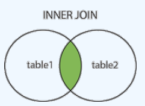
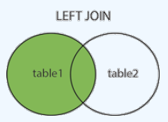
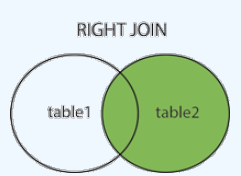
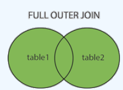
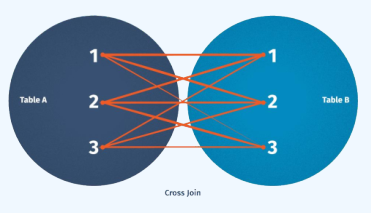
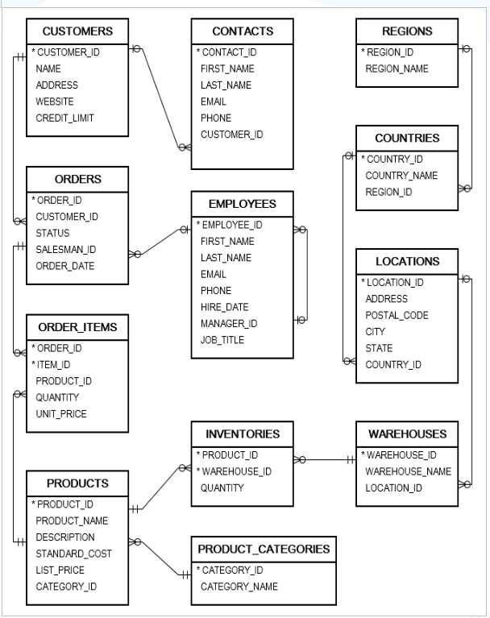

# Module 05: Joins

## Table of Contents

<ol>
    <li><a href="#overview">Overview</a></li>
    <li><a href="#objectives">Objectives</a></li>
    <li><a href="#definition">Definition</a></li>
    <li><a href="#inner-join">INNER JOIN</a></li>
    <li><a href="#left-outer-join">LEFT OUTER JOIN</a></li>
    <li><a href="#right-outer-join">RIGHT OUTER JOIN</a></li>
    <li><a href="#full-outer-join">FULL OUTER JOIN</a></li>
    <li><a href="#cross-join">CROSS JOIN</a></li>
    <li><a href="#exercises">Exercises</a></li>
</ol>

## Overview

This chapter focuses on SQL JOIN operations, which allow combining data from multiple tables based on a related column.
Understanding JOIN types is essential for efficient data retrieval and relational database management. The chapter
covers different types of JOINs and their use cases, along with practical SQL queries for each.

## Objectives

- Understand the importance of `JOIN` in SQL for combining data from multiple tables.
- Learn the differences between `INNER JOIN`, `LEFT JOIN`, `RIGHT JOIN`, `FULL JOIN`, and `CROSS JOIN`.
- Be able to write and execute SQL JOIN queries effectively.
- Apply `JOIN` concepts in real-world database scenarios.

## Definition

- The `JOIN` command is used to link and retrieve data from two or more tables in a database.
- Allows combining data from multiple tables into one result set.
- Different `JOIN` types include INNER, LEFT, RIGHT, FULL OUTER, and CROSS JOIN.
- `JOIN` can be used with clauses like `GROUP BY`, `WHERE`, `SUBQUERIES`, and `AGGREGATE FUNCTIONS`.

## INNER JOIN

- `INNER JOIN` returns only the rows that have matching values in both tables.
- It compares each row in both tables to find matching pairs.
- Syntax:
  ```sql
  SELECT column_name (s)
  FROM table1
  INNER JOIN table2
  ON table1.column_name = table2.column_name;
  ```
- Example:
  ```sql
  SELECT prd.product_id, prd.category_id, prd_cate.category_name --Gets product_id, category_id, and category_name for products that have a matching category.
  FROM products prd 
  INNER JOIN product_categories prd_cate 
  ON prd.category_id = prd_cate.category_id;
  ```
  .

## LEFT OUTER JOIN

- `LEFT OUTER JOIN` returns all records from the left table and the matching records from the right table.
- If no match is found, NULL values are returned for columns from the right table.
- Syntax:
  ```sql
  SELECT column_name (s)
  FROM table1
  LEFT JOIN table2
  ON table1.column_name=table2.column_name;
  ```
- Example:
  ```sql
  SELECT cst.customer_id, cst.name, contacts.email, contacts.phone -- Lists all customers, showing their contact details if available.
  FROM customers cst
  LEFT JOIN contacts conts
  ON cst.customer_id = conts.customer_id
  ORDER BY cst.customer_id;
  ```  
  .

## RIGHT OUTER JOIN

- `RIGHT OUTER JOIN` returns all records from the right table and the matching records from the left table
- If no match is found, NULL values are returned for columns from the left table.
- Syntax:
  ```sql
  SELECT column_name (s)
  FROM table1
  RIGHT JOIN table2
  ON table1.column_name=table2.column_name;
  ```
- Example:
  ```sql
  SELECT cst.customer_id, cst.name, contacts.email, contacts.phone -- Lists all contacts, showing customer details if available.
  FROM customers cst
  RIGHT JOIN contacts conts
  ON cst.customer_id = conts.customer_id
  ORDER BY cst.customer_id;
  ```
  .

## FULL OUTER JOIN

- `FULL OUTER JOIN` combines `LEFT OUTER JOIN` and `RIGHT OUTER JOIN`.
- It returns all records from both tables, filling NULL values for unmatched rows.
- Syntax:
  ```sql  
  SELECT column_name (s)
  FROM table1
  FULL OUTER JOIN table2
  ON table1.column_name=table2.column_name;
  ```
- Example:
  ```sql
  SELECT cst.customer_id, cst.name, contacts.email, contacts.phone --Lists all customers and contacts, linking them where possible.
  FROM customers cst
  FULL JOIN contacts conts
  ON cst.customer_id = conts.customer_id
  ORDER BY cst.customer_id;
  ```
  .

## CROSS JOIN

- `CROSS JOIN` returns the Cartesian product of two tables, meaning each row from the first table is combined with every
  row from the second table.
- Syntax:
  ```sql   
  SELECT column_name (s)
  FROM table1
  CROSS JOIN table2;
  ```
- Example:
  ```sql
  SELECT wh.warehouse_id, wh.warehouse_name, rg.region_name --Pairs all warehouses with all regions.
  FROM warehouses wh
  CROSS JOIN regions rg;
  ```
  .

## Exercises

- Data Description

| Table Name         | Description                                                     |
|--------------------|-----------------------------------------------------------------|
| EMPLOYEES          | Sales employees' information                                    |
| CUSTOMERS          | Customer details                                                |
| CONTACTS           | Customer contact details                                        |
| PRODUCTS           | Product information                                             |
| PRODUCT_CATEGORIES | Product category details                                        |
| ORDERS             | Order details, including sales, customer, and total order value |
| ORDER_ITEMS        | Order item details (products, quantity, price)                  |

- Entity Relationship Model

.

1. INNER JOIN
    - Retrieve customer information:
        - `Customer ID`, `Full Name`, `Address`, `Email`, `Phone Number`
    - Retrieve product details with category name:
        - `Product Name`, `Category Name` (Only for products with categories)
    - Retrieve employee hierarchy:
        - `Employee ID`, `Employee Name`, `Manager ID`, `Manager Name`
    - Retrieve all orders with customer details:
        - `Order ID`, `Order Date`, `Customer Name`, `Customer Address`
    - Retrieve all orders with sales employees:
        - `Order ID`, `Order Date`, `Sales Employee Name`, `Email`, `Phone` (Only orders with sales employees)
    - Retrieve product inventory details:
        - `Product Name`, `Warehouse ID`, `Stock Quantity` (Only products with stock available)
2. LEFT JOIN
    - Retrieve product details, including those without a category.
    - Retrieve all orders with sales employees, including orders without assigned employees.
    - Retrieve product inventory details, including products without stock.
3. RIGHT JOIN
    - Retrieve product details, including categories without products.
    - Retrieve all orders with sales employees, including employees without sales orders.
4. FULL OUTER JOIN
    - Retrieve all order IDs and employee information, identifying which orders have sales employees and which do not.
    - Retrieve all product inventory details, identifying products with and without stock.
5. Aggregate Queries
    - Retrieve all orders where customers have a credit limit of at least `500`.
    - Retrieve all `Shipped` orders after `January 20, 2017`, including customer and sales employee details.
    - Retrieve orders handled by employees who signed contracts after `March 1, 2016`.
    - Retrieve product inventory details for products with stock greater than `2`.

Homework Exercises

1. Retrieve general customer information:
    - `Customer ID`, `Full Name`, `Address`, `Email`, `Phone Number`
2. Retrieve customers whose addresses end with `'MI'`.
3. Retrieve customers with a credit limit between `500 - 700` and phone numbers starting with `+39`.
4. Retrieve the **top 10 customers** with the highest credit limit (sorted in descending order).
5. Calculate the total revenue per customer.
6. Identify the **highest revenue customer** in 2017.
7. Identify the **lowest revenue customer** in 2017.
8. Retrieve the **top 10 customers** with the highest average order value (sorted in ascending order).
9. Calculate total revenue for `Shipped` orders placed after `January 1, 2017`.
10. Calculate total revenue for `Pending` orders from `2015 - 2017` (rounded to one decimal place).
11. Calculate monthly and yearly total revenue per customer, sorted by customer name, month, and year.
12. Calculate total value of canceled orders per customer per year, including highest and lowest canceled orders.