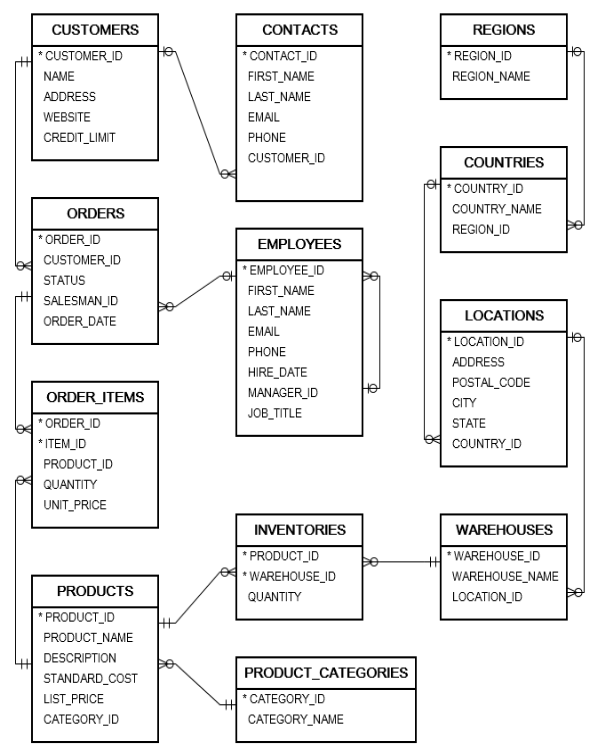

# Week 2: Query

## Table of Contents
<ol>
    <li><a href="#objectives">Objectives</a></li>
    <li><a href="#data-definition-language">Data Definition Language</a></li>
    <li><a href="#data-query-language">Data Query Language</a></li>
    <li><a href="#data-manipulation-language">Data Manipulation Language</a></li>
    <li><a href="#data-control-language">Data Control Language</a></li>
    <li><a href="#transaction-control-language">Transaction Control Language</a></li>
    <li><a href="#exercises">Exercises</a></li>
</ol>

## Overview
This chapter introduces the fundamental skills of interacting with databases using SQL queries. 
Queries are used to retrieve, analyze, and manipulate data stored in databases. 
This chapter lays the foundation for understanding how to write SQL commands to interact with data in database.


## Objectives
- Having basic knowledge about SQL Query.
- Understand and able to use common SQL Query (SELECT, INSERT, UPDATE,...).
- Able to write basic SQL queries to fetch and filter data.
- Practice with exercise.

## Data Definition Language
Data Definition Language or DDL consists of the SQL commands that can be used to 
defining, altering, and deleting database structures such as tables, indexes, and schemas.

| Command       | Description                                                                                   | Syntax                                                               |
|---------------|-----------------------------------------------------------------------------------------------|----------------------------------------------------------------------|
| **CREATE**    | Create database or its objects (table, index, function, views, store procedure, and triggers) | CREATE TABLE table_name (column1 data_type, column2 data_type, ...); |
| **ALTER**     | Alter the structure of the database                                                           | ALTER TABLE table_name ADD COLUMN column_name data_type;             |
| **DROP**      | Delete objects from the database                                                              | DROP TABLE table_name;                                               |
| **RENAME**    | Rename an object existing in the database                                                     | RENAME TABLE old_table_name TO new_table_name;                       |
| **TRUNCATE**  | Remove all records from a table, including all spaces allocated for the records are removed   | TRUNCATE TABLE table_name;                                           |
| **COMMENT**   | Add comments to the data dictionary                                                           | COMMENT 'comment_text' ON TABLE table_name;                          |

```sql
CREATE TABLE employees (
    employee_id INT PRIMARY KEY,
    first_name VARCHAR(50),
    last_name VARCHAR(50),
    hire_date DATE
);
```

```sql
ALTER TABLE employees ADD COLUMN job_title VARCHAR(50);
```

```sql
DROP TABLE employees;
```

## Data Query Language

Data Query Language or DQL is used for performing queries on the data within schema objects.  

| Command    | Description                                   | Syntax                                                       |
|------------|-----------------------------------------------|--------------------------------------------------------------|
| **SELECT** | It is used to retrieve data from the database | SELECT column1, column2, ...FROM table_name WHERE condition; |


We have table `employees`

| employee_id | first_name | last_name |
|-------------|------------|-----------|
| 1           | Summer     | Payne     |
| 2           | Tommy      | Bailey    |
| 3           | Ryan       | Gray      |


We can get employee id, first name, last name of employees from table using

```sql
SELECT employee_id, first_name, last_name FROM employees;
```

| employee_id | first_name | last_name |
|-------------|------------|-----------|
| 1           | Summer     | Payne     |
| 2           | Tommy      | Bailey    |
| 3           | Ryan       | Gray      |

**Alternatively**, we can use <b>*</b> (asterisk) to represents for all column(s) in table.

We can simply write query to get all column(s) from table `employees` 

```sql
SELECT * FROM employees;
```
<br>

#### WHERE Clause

`WHERE` clause is used to  filter extract only those records that fulfill a specified condition(s).


| employee_id | first_name | last_name | job_title  |
|-------------|------------|-----------|------------|
| 1           | Summer     | Payne     | Accountant |
| 2           | Tommy      | Bailey    | Developer  |
| 3           | Ryan       | Gray      | Sale       |

We want to get employee id, first name, last name of employees with job title Accountant

```sql
SELECT employee_id, first_name, last_name
FROM employees
WHERE job_title = 'Accountant';
```

| employee_id | first_name | last_name | job_title  |
|-------------|------------|-----------|------------|
| 2           | Tommy      | Bailey    | Developer  |

<br>

#### Comparison Operators

Comparison operator is a mathematical symbol which is used to compare two values.

Comparison operators are used in conditions that compares one expression with another. The result of a comparison can be TRUE, FALSE, or NULL

| Operator | Description                                                      | Sample | Result |
|----------|------------------------------------------------------------------|--------|--------|
| =        | To check if 2 values is equal                                    | 4 = 4  | true   |
| <>       | To check if 2 values is not equal                                | 4 <> 5 | true   |
| \>       | To check if left value is greater than right value               | 4 > 5  | false  |
| <        | To check if left value is less than right value                  | 4 < 5  | true   |
| \>=      | To check if left value is greater than or equal with right value | 4 >= 4 | true   |
| <=       | To check if left value is less than or equal with right value    | 4 <= 3 | false  |

Example
```sql
SELECT * FROM employees WHERE employee_id > 2;
```
<br>

#### Logical Operators

Logical Operators combine conditions in a `WHERE` clause to create more complex expressions. Operators can be symbols or keywords used to perform operations on data.

| Operator    | Description                                                                                                                   | Sample                                                            |   
|-------------|-------------------------------------------------------------------------------------------------------------------------------|-------------------------------------------------------------------| 
| **AND**     | The **AND** operator combines two conditions and returns TRUE if both conditions are TRUE                                     | WHERE first_name = 'Matt' AND age < 40                            |
| **OR**      | The **OR** operator combines two conditions and returns TRUE if at least one condition is TRUE                                | WHERE first_name = 'Matt' OR age < 40                             |
| **BETWEEN** | The **BETWEEN** operator is used in the WHERE clause of a SQL query to specify a range of values to be returned               | WHERE price BETWEEN 50 AND 100                                    |
| **IN**      | The **IN** operator often used in the WHERE clause to test whether a column’s value is present in a set of specified values   | WHERE job_title IN ('Accountant', 'Developer')                    |
| **LIKE**    | The **LIKE** operator is used to search for a specific pattern in a string value.                                             | WHERE first_name LIKE '%Tom%'                                     |
| **EXISTS**  | The **EXISTS** operator is used to test for the existence of any record in a subquery                                         | WHERE EXISTS (SELECT column_name FROM table_name WHERE condition) |
| **NOT**     | The **NOT** operator is used in combination with other operators to give the opposite result, also called the negative result | WHERE NOT job_title = 'Accountant'                                |
| **IS NULL** | The **IS NULL** operator tests for NULL (or empty) values in a column                                                         | WHERE job_title IS NULL                                           |

Example

```sql
SELECT * FROM employees WHERE job_title IN ('Accountant', 'Developer') AND employee_id BETWEEN 1 AND 10;
```
<br>

#### GROUP BY
`GROUP BY` clause is used to group rows based on the value of columns.

The GROUP BY statement is often used with aggregate functions (COUNT(), MAX(), MIN(), SUM(), AVG()) to group the result-set by one or more columns.

`GROUP BY` is placed **AFTER** the `WHERE` clause.  
`GROUP BY` is placed **BEFORE** the `ORDER BY` and `HAVING` clause if used.  

#### HAVING
`HAVING` clause is used if we need to filter the result set based on aggregate functions such as **MIN()** and **MAX()**, **SUM()** and **AVG()**, and **COUNT()**.

#### ORDER BY
`ORDER BY` clause is used to sort the result set in ascending (ASC) or descending (DESC) order, default sort will be ascending (ASC) if not specified.

```sql
SELECT <Columns>
FROM <Table Name>
WHERE <Conditions>
GROUP BY <Columns>
HAVING <Condition>
ORDER BY <Column Name(s) [Sorting]>;
```

Example
```sql
SELECT customer_id, SUM(amount) AS total
FROM Orders
GROUP BY customer_id
HAVING SUM(amount) < 500
ORDER BY custormer_id ASC;
```

## Data Manipulation Language

Data Manipulation Language or DML is a subset of operations used to insert, update, and delete data in a database.

| Command          | Description                          | Syntax                                                                       |
|------------------|--------------------------------------|------------------------------------------------------------------------------|
| **INSERT**       | Insert data into a table             | INSERT INTO table_name (column1, column2, ...) VALUES (value1, value2, ...); |
| **UPDATE**       | Update existing data within a table  | UPDATE table_name SET column1 = value1, column2 = value2 WHERE condition;    |
| **DELETE**       | Delete records from a database table | DELETE FROM table_name WHERE condition;                                      |
| **LOCK**         | Table control concurrency            | LOCK TABLE table_name IN lock_mode;                                          |
| **CALL**         | Call a PL/SQL or JAVA subprogram     | CALL procedure_name(arguments);                                              |
| **EXPLAIN PLAN** | Describe the access path to data     | EXPLAIN PLAN FOR SELECT * FROM table_name;                                   |

Example
```sql
INSERT INTO employees (first_name, last_name, job_title) 
VALUES ('Jane', 'Smith', 'Developer');
```

```sql
UPDATE employees SET first_name = 'David' WHERE employee_id = 1;
```

```sql
DELETE FROM employees WHERE employee_id = 1;
```

## Data Control Language

Data Control Language (DCL) includes commands such as **GRANT** and **REVOKE** which mainly deal with the rights, permissions, and other controls of the database system. These commands are used to control access to data in the database by granting or revoking permissions.

| Command    | Description                                                                                                                   | Syntax                                                                                                     |
|------------|-------------------------------------------------------------------------------------------------------------------------------|------------------------------------------------------------------------------------------------------------|
| **GRANT**  | Assigns new privileges to a user account, allowing access to specific database objects, actions, or functions.                | GRANT privilege_type [(column_list)] ON [object_type] object_name TO user [WITH GRANT OPTION];             |
| **REVOKE** | Removes previously granted privileges from a user account,   taking away their access to certain database objects or actions. | REVOKE [GRANT OPTION FOR] privilege_type [(column_list)] ON [object_type] object_name FROM user [CASCADE]; |

Example

```sql
GRANT SELECT, UPDATE ON employees TO user_name;
```

```sql
REVOKE UPDATE ON employees FROM user_name; 
```

## Transaction Control Language

Transactions group a set of tasks into a single execution unit. Each transaction begins with a specific task and ends when all the tasks in the group are successfully completed. If any of the tasks fail, the transaction fails. Therefore, a transaction has only two results: **success** or **failure**. We can explore more about transactions in [Chapter 8](../8.%20Transaction/README.md).

| Command               | Description                                        | Syntax                                     |
|-----------------------|----------------------------------------------------|--------------------------------------------|
| **BEGIN TRANSACTION** | Starts a new transaction                           | BEGIN TRANSACTION [transaction_name];      |
| **COMMIT**            | Saves all changes made during the transaction      | COMMIT;                                    |
| **ROLLBACK**          | Undoes all changes made during the transaction     | ROLLBACK;                                  |
| **SAVEPOINT**         | Creates a savepoint within the current transaction | SAVEPOINT savepoint_name;                  |
| **SET TRANSACTION**   | Set transaction isolation level and access mode    | SET TRANSACTION [READ WRITE \| READ ONLY]; |

Example

```sql
BEGIN TRANSACTION;
UPDATE employees SET department = 'Marketing' WHERE department = 'Sales';
SAVEPOINT before_update;
UPDATE employees SET department = 'IT' WHERE department = 'HR';
ROLLBACK TO SAVEPOINT before_update;
COMMIT;
```

## Exercises

**We have these following tables as below**

| Table                | Description                                        | Note                                          |
|----------------------|----------------------------------------------------|-----------------------------------------------|
| `employees`          | Employees information                              |                                               |
| `customers`          | Customers information                              |                                               |
| `contacts`           | Customers contacts                                 |                                               |
| `products`           | Product information                                |                                               |
| `product_categories` | Product categories                                 | Link to table `products` using **product_id** |
| `orders`             | Order information                                  |                                               |
| `order_items`        | Detail of each order(product, quantity, price,...) | Link to table `orders` using **order_id**     |

### Database Diagram

.

1. `SELECT` all column(s) from table
   - Get all information in table `employees`
   - Get all information in table `customers`
   - Get all information in table `orders`
   - Get all information in table `products`

2. `SELECT` specific column(s) in table
   - Get information for employee_id, first_name, last_name, email, hire_date from table `employees`
   - Get information for customer_id, name, address from table `customers`
   - Get information for order_id, customer_id, order_date, sale_man from table `orders`
   - Get information for product_id, product_name, description from table `products`

3. `SELECT` column, table alias
   - Get information for employee_id, first_name, last_name, email, hiring_date and change to ma_nv, ten, ho, thu_dien_tu, ngay_nhan_viec in table `employees`
   - Get information for customer_id, name, address and change to ma_khach_hang, ten_khach_hang, dia_chi in table `customers`
   - Get information for order_id, customer_id, order_date, sale_man and change to ma_don_hang, ma_khach_hang, ngay_dat_hang, nguoi_ban in table `orders`
   - Get information for product_id, product_name, description and change to ma_san_pham, ten_san_pham, mo_ta in table `products`

4. `SELECT` distinct
   - Get list all job_title in table `employees`, each job_title will appear only **once**
   - Get list all first_name in table `employees`, each first_name will appear only **once**

5. `WHERE` Clause
   - Get information about employee with id 28
   - Get information about employee has email "abigail.palmer@example.com" and phone number is "650.505.4876"
   - Get information about employee with first name Elliot or last name is Cooper
   - Get information about customers with credit limit greater than 1000
   - Get information about customers with credit limit greater than or equal 2000
   - Get information about customers with credit limit less than 3200
   - Get information about customers with credit limit less than or equal 2400
   - Get order information which has order date after 1/1/2024

6. `TO_DATE()`
   - Get order information with order date in range 1/1/2024 and 30/11/2024

7. WILDCARD
   - Get customer information with name starts exactly with "Jack"
   - Get customer information with name ends exactly with "Corp"
   - Get customer information with name contains "John" or "Doe"
   - Get customer information with name stars with "I" and has 3 characters (including "I")
   - Get customer information with name ends with "P" and has 2 characters (including "P")
   - Get customer information with name contains "n" in second position

8. `IN` keyword
   - Get product information with name in the following list (G.Skill Ripjaws V Series, ASRock X99 Extreme11, Intel Xeon E5-2697 V2)
   - Get product information with name not in the following list (Corsair Vengeance LPX, Corsair Dominator Platinum, Kingston)

9. SQL queries for following requirements
   - Get all products
   - Get product name of product with id = 225
   - Get product(s) with standard cost greater than 300
   - Get product(s) with standard cost not equal 500
   - Get product(s) with list price in range from 300 to 700
   - Get product(s) with name "G.Skill Trident Z" and standard cost greater than 500
   - Get product(s) with name "Corsair Dominator Platinum" and standard cost greater than or equal 600 and list price greater than 700
   - Get product(s) with name contains "Kingston"
   - Get product(s) with name starts with "G.Skill" and list price greater than 650
   - Get product(s) with name end with "Series" and has description contains "128GB"
   - Get product(s) start with "C" and has 7 characters (including C) and list price not equal 700
   - Get product(s) with list price is 2200, 1850, 1756, 1249 respectively
   - Get all order(s) that had been sold in 2024
   - Get all order(s) that had been sold from 2023 to 2024
   - Get all order(s) with order date greater than "2024-02-01'
   - Get all order(s) with order date in "2024-02-13" have status "Shipped"
   - Get all order(s) with order date '2024-02-14' order by total ascending
   - Get all order(s) with order date not equal '2024-08-15' order by total descending
   - Get all order(s) with status (Pending, Shipped) and have total greater than 40000, order by order date ascending
